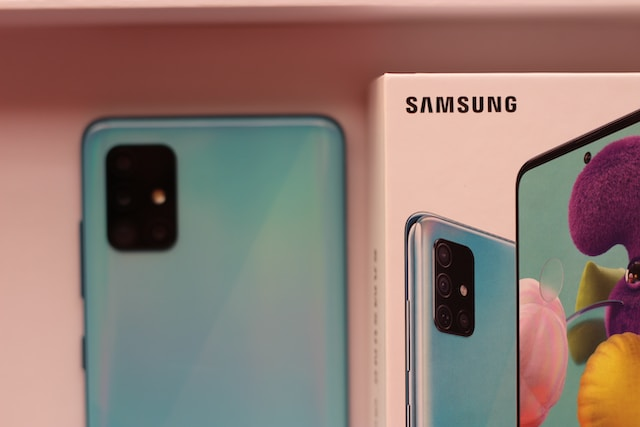

### Buying a phone in 2023? What you need to know.
Its not always time to change your phone to a new one, but if this is you right now, you might need to know a thing or two before you get on with it.

<md-block>

<md-block>

Photo by <a href="https://unsplash.com/@ravinepz?utm_source=unsplash&utm_medium=referral&utm_content=creditCopyText">Ravi Sharma</a> on <a href="https://unsplash.com/photos/HCoHGXiDMpE?utm_source=unsplash&utm_medium=referral&utm_content=creditCopyText">Unsplash</a>

###### Disclaimer: Personal views expressed in this guide, this is not financial advice.
###### In this guide:
- a). What you need to know
- b). What to consider

##### a). What you need to know:

###### Samsung
You buy `Samsung` if you generaly do not want to ever have an issue with your phone - in most cases, compared to other brands. Samsung takes a keen interest in `quality` of both `hardware and software` to ensure a certain standard. Globally, Samsung is known to manufacture devices featuring considerable to excellent hardware paired with their `OneUI` experience which is based on Android. The keen attention to quality means that Samsung devices are known to last for quite some time compared to other devices.

###### Google
You buy `Google` if you want to experience a `cutting edge software experience`, `pure android` at its best with mouth watering features curated by Google for you. Google has been in the smartphone business all along as the famous Android we so much use is made by Google. However, it is less known of Google to venture into the actual manufacturing of devices, they've always been a software company. There have been a few Google devices over the years going by the name `Nexus` where Google would co-develop a device with a hardware manufacturer for the best of both, until Google decided to go all in on manufacturing devices with the `Google Pixel` series of phones. These Nexus devices received pure `unbloated android` and frequent updates, which is also the case with the current Google Pixel series which took over from the Nexus Program.

###### Xiaomi
You buy `Xiaomi` if you want `freedom` (for a techie-kind-of person). Freedom in the android world, to make your phone as good and as modified as you'd like it to be with the excellent custom software support. Xiaomi is a `young company` (just over a decade old) compared to the technological behemoths it is up against. Over the years, Xiaomi has worked its way up the ladder to be among the `top 5` in the industry. I do not have that much experience with Xiaomi devices prior to 2022, but in my short exposure, I have gathered a thing or two. Xiaomi pays a lot of attention to its Chinese market, Xiaomi phones launch earlier in China than the rest of the world - launches are sometimes months apart for the same device - and the software experience on Xiaomi phones sold in China is premium compared to what global users get - which includes Kenyan users. Xiaomi's android skin, `MIUI`, is execptional in China - you get MIUI based system apps and dialogues and a whole lot of additional features. MIUI global, on the other hand, is an` abysmal and a half-baked` software experience - what you get is a software experience stripped of the entire identity of MIUI, swapping out MIUI system apps and dialogues for their Google alternatives. Consequently, the hatched UI is a confusing mess - an awful blend with very strict battery, background apps and ram mangement which makes multitaksing a haunting nightmare. To counter this strict system management, a user has to dig deep into the settings disabling optimizations and locking apps to the ram, but lets be realistic - not everyone is up to this daunting task. This brings us to my earlier statement - I'd recommend a Xiaomi phone, but to a techie. Hear me out, `Xiaomi makes great phones`, the current `Xiaomi 13 Ultra` is one of the best flagships out there - but not everyone is buying a flagship. Xiaomi's approach of offering the best hardware for whatever your budget is, is an excellent approach and I think that that is part of their success. However, to take full advantage of the good hardware, you need to know a thing or two in smartphones and computing in general. In my own experience, to leverage the full might of MIUI, you need to install the Chinese version of your device's OS. But what if you are not Chinese literate? Well, that is where `custom ROMs` come in, hence the reason I'd only recommend a Xiaomi phone to a techie. Not a fan of going custom on your brand new Xiaomi phone? Do not fret, yet. There is a sweet middle ground for you. Seeing that MIUI China gets all the good stuff, some independent developers port and modify the Chinese ROM, debloating it, translating it to other languages, and removing ads in the system for a clean MIUI experience. That is how I landed the `MIUI EU` ROM - a custom spin of MIUI China. I honestly did not intent for this Xiaomi paragraph to be this long - : ).

###### Nokia
You buy `Nokia` if you want a phone that will `just work` - make a phone call, take a picture, send a message, last the whole day on a single charge and so on. A phone that will just work for the average person, with minimal modifications. It might not get there fast enough, but it will get it done. We all know of the legendary `Nokia 3310`, the unbreakable masterpiece. I have been around Nokias for a considerable amount of time and I have not heard a lot of negative comments about them. I also like Nokia's approach to Android. Nokia tries to keep it simple - with minimal modifications to Android thus users get a clean software experience. However, recently, I have been going around doing my interneting and I have noticed that these Nokia phones have some real slow processors in them, just letting you know. It will get the job done though, but you might need to grab a sip of your coffee while you wait.

###### Transsion
`Tecno? Infinix?` Well, why not talk about them. These two brands fall under `Transsion`. Transsion is a Chinese phone manufacturer, its brands include `Tecno, Infinix, Itel, Oraimo` and the aftersale services brand `Carlcare`. Simply put, you buy Transsion if you do not care about software updates or your rights as an Android user to get the best out of Android. In my years, I have never heard of a Transsion device getting a major OS upgrade. A major OS upgrade, when it comes to smartphones, is usually when you buy a phone with a certain Android version and then months or years later, the phone is updated to a higher Android version. Even on the budget level where phones are stripped to their bare minimum to cut costs, most brands like Nokia and Samsung will try their best and give you two major updates, if not one - say from Android 10 to 11 or 12. In a world where most phones get three major OS updates, with some topping out at five, if feels illegal for a brand to `not even offer one major OS upgrade`, leave alone two which is considered the bare minimum. I do like Carlcare though, I have experience with their aftersale services and I can confidently say that they are good, is that what you get for ditching OS updates?

Any other brands you need me to talk about? Please, do not hesitate to [contact](#contact) me.

##### b). What to consider:
###### Type-C
If you are spending a substancial amount, please do not get antyhing that does not charge over type-c. Why?
- 1). `Type-C is newer`, better, more versatile by all aspects - charging speed, compatibility with a lot of accessories, faster data transfer speeds and so on. Micro-B is an ancient technology that is being phased out on most consumer devices.
- 2). Embrace change, : ).

###### 1080p Display
Phones are getting `bigger and bigger` as the day goes by, and consequently, so are the displays. It is not uncommon to see phones bragging about `6.7" dispalys` that were unheard of some two or three years ago. But as displays get bigger, the `resolution` also needs to increase counter the increasing pixel size. It `irks me to see` displays as big as `6.5"+ boasting of a 720p display`. Such an abomination. Some would argue that 720p displays should not even be as big as 6.4" and I am inclined to agree. For a long while, I lived with a 720p 6.4" display and I have to admit that in most cases, I could make out individual pixels on the screen. Is the phone you are buying 6.4" or more? If you are spending north of 15 000 KES, you deserve a 1080p (or more) display.

##### Sources:
https://www.digitaltrends.com/mobile/history-of-google-nexus/